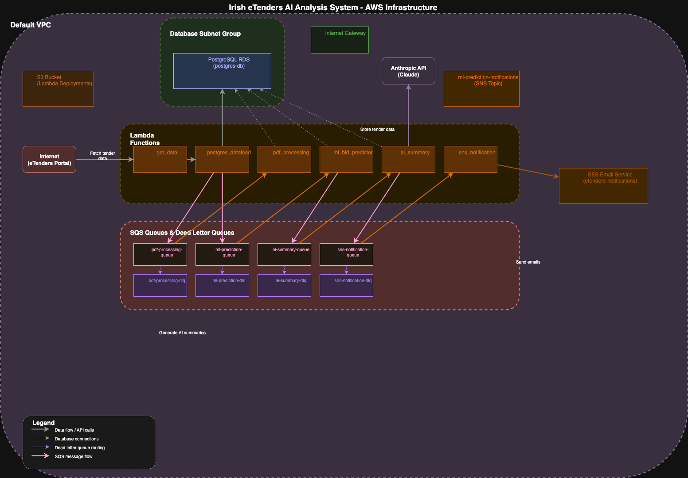

# Evaluation of Current State <!-- 1000 words -->

## Endpoint Inventory

Our application is entirely cloud based (on AWS) and consists primarily of AWS Lambda (serverless) functions and AWS RDS using PostgreSQL. 

It's worth mentioning that some architectural approaches, like using serverless functions, remove whole classes of issues and vulnerabilities. 

TODO: _Get hold of a reference of some sort to back this up_ 
TODO: _At the moment this doesn't 'appear' to be the case, according to the literature I've found_

However, while we aren't having to manage and patch operating systems other serverless specific issues need to be considered.

### AWS RDS (PostgreSQL) db connection
The first serverless function `postgres_dataload` goes and gets the latest electronic tenders. Anything this function retrieves is stored in the RDS PostgreSQL database. 

The database is updated by subsequent lambda functions as the tender is processed for potentially being something that should be responded to or not. The purpose of the database is to keep a record of what has been examined by the machine learning lambda, potentially as a source of retraining the ML component and shows where in the analysis pipeline a tender is.

### GitHub action pipelines
These are used to deploy Terraform defined resources into AWS and also to build the AWS Lambdas (in Rust) and upload them to AWS S3.

### AWS S3
To allow multiple developers to work on the project there is an S3 object location for the Terraform state file. This use of an S3 bucket to hold the Terraform state file is defined in the code.

Having the state file in S3 allows for multiple developers to make changes to a common state file, rather than maintaining their own local state file copy. 

The S3 bucket is also where the AWS Lambdas are uploaded to when built. Each Lambda function grabs the .zip file from it's bucket location and runs it as part of it's execution process.

### AWS Lambda functions & queues
All the Lambda functions exist within the AWS environment and their 'event driven' architecture uses AWS Simple Queue Service to initialize new function instances and post results onto the next queue in the chain.

### AWS Simple Notification Service
To alert the sales team to a potential bid this service sends an email to a recipient list.

<!-- 
TODO: need a data flow diagram here to illustrate primarily how data flows through the application
-->

<!-- 
#### Postgres-dataload
This is the function that kicks off the whole process of deciding which tenders to actually bid on. It's triggered on a schedule so at 09:00 it goes and get's the tender info and puts what's there on an SQS queue as well as updating the Post

#### pdf processor
If there's a tender containing a pdf it'll pick that tenders pdf url off the SQS queue, read the text from the PDF and update the database with the PDF content. This allows the PDF content to be supplied to the ML layer or later to the AI lambda for further analysis. 

#### ml processor
Tenders without PDF content go straight onto the ai_summary queue becase the ML setup hasn't got enough context to accurately predict wheter to bid on something or not. If there is a PDF then the ML processor will return a score  

#### ai summary
Takes items off the ai_summary queue and sends their content to a Claude Endpoint using an acount Key that's been generated by a developer and added to the project's GitHub secrets account

#### sns
-->

### AWS IAM IMPORTANT: DEFINITELY COVER THIS

https://genai.owasp.org/llm-top-10/ <-- use as a reference for analysis

TODO: 
- NETWORK DIAGRAM (current state)
  - Are there any automation tools that will WORK and produce a diagram from terraform automatically??
  - https://github.com/patrickchugh/terravision
  - pluralith
  - terraform graph - run command - hand it to something else? Graphviz?
  - terraform visual, can run in CICD

- ENDPOINT LIST
 - ROLE
 - RISK/SIGNIFICANCE

IMPORTANT: DO NOT TALK ABOUT REMEDIATION AT ALL IN THIS SECTION
 - JUST THE DIAGRAM AND ENDPOINT INVENTORY HERE
 - IN no particular order

### AWS RDS (PostgreSQL) db connection
Open to the internet for ease of development from Windows machine using PgAdmin 4 application. REF: 
TODO: 
 - Add link to docs
 - Find out how encryption works to/from here

TODO: Look at the CVE site for the things in the system

<!-- 
 * draw IO for network diagram
 * look at OWASP AI/LLM stuff
 * explain topology i.e. ALL CLOUD or STAR or something else
 * what are the key concepts on the diagram
 * argue for why improvements made, justify decisions
 * diagram for after, for example
 * support the WHY with industry best practice
  * GDPR is that's relevant
  * CVE's severity etc.

MILESTONE 3 - score the likelyhood of a breach vs. a framework. 
-->

<!--
* Create an Inventory of accessible network endpointscategorized by role, operating system and significance, using advanced scanning tools

* Create a basic network diagram that can include components like routers, switches, servers and workstations
-->

## Cybersecurity Analysis

TODO: Run wireshark on the coms to PgAdmin 4 to the database

TODO: List CVE/vulnerability analysis tools that could be used in this case, including AWS Security hub vulnerability list.

IMPORTANT: What Frameworks of references are we going to use for our CyberSecurity analysis?

Since our application is cloud-based and primarily uses serverless functions we have some things to consider that don't fall in the usual legacy hardware/virtual machine/networking approach.

TODO: 
- AWS IAM
 - BEST PRACTICES ARE WHAT?
- TOOLS ADVANTAGES AND DISADVANTAGES
- THREAT ANALYSIS 
 - ESPECIALLY IN RELATION TO DATA
 - WHAT SCANNING TOOLS APPLY HERE?

* "well architected framework"
* AWS security advisor
* Trivy security analysis for Terraform
* Other 'best practice' frameworks for cloud/serverless
* WHAT SECURITY FRAMEWORKS APPLY TO THE AI COMPONENT

https://www.cvedetails.com/vendor/336/ <- postgreSQL
https://medium.com/@simardeep.oberoi/unveiling-github-actions-vulnerabilities-a-comprehensive-technical-guide-to-attack-vectors-and-6a26a83e9fb2
https://nvd.nist.gov/vuln-metrics/cvss/v3-calculator

IMPORTANT: DO NOT TALK ABOUT REMEDIATION AT ALL IN THIS SECTION

### AWS RDS (PostgreSQL) db connection
As can be seen from the AWS RDS security group config, the AWS RDS db connection is open to the internet. It was set up this way initially so that the application developers could quickly validate and iterate on the database design from their local machines.

TODO: Add code pic here

While there is definitely a convenience to be had from quickly running queries locally as the solution is being developed, access over the web secured by a simple username/password puts this as a high risk activity. 

TODO: Is there an AWS based web interface from which you can run queries instead??

Open to the internet for ease of development from Windows machine using PgAdmin 4 application. REF: https://www.pgadmin.org/
TODO: 
 - Add link to docs
 - Find out how encryption works to/from here
 - Run wireshark on connections to the db via Pgadmin to see whether or not these are encrypted

### GitHub Action Pipelines
Every interaction with the AWS resources is run via GitHub action pipelines all the secrets needed to access the environment are stored as GitHub Action Secrets, which are all secured via 2-Factor-Authentication (2FA) linked to the developers GitHub account.

### AWS S3
Upload to S3 is only available via the GitHub action pipelines and all the secrets needed to access the environment are stored as GitHub Action Secrets, which are all secured via 2-Factor-Authentication (2FA) 

#### AWS Lamda zip files
#### Terraform State file

<!-- 
- clear text/issues
-->

<!-- 
* Provide an overview of existing accessible and relevant protection mechanisms such as anti-virus, anti-malware and EDR systems, encryption and access controls

* Analyse the efficiency of these tools, highlight their advantages and disadvantages

* Analyse the effectiveness of protections and IDS/IPS systmes such as firewalls, VPNs, and endpoint protection software.

* Identify areas needing improvement, focusing on deficiencies that could expose endpoints to threats.

* My project is endpoint and data protection, out of the examples

-->

<!-- MARKING RUBRIC

CONDUCTS COMPREHENSIVE RESEARCH
* clear and detailed explanation of the network design, management and security
* include insightful examples and best practices
* create a detailed and well organised network diagram which...
  * accurately represents the network endpoints and their roles

EVALUATE A DIGITAL OR DATA NETWORK FOR COMMON VULNERABILITIES AND RISKS
* Conduct a thorough vulnerability assessment using industry standard tools
* analyze findings and identifies common vulnerabilities and risks in...
  * a clear and concise manner with...
  * additional insights and examples 

All this needs to be evidenced in this section

-->