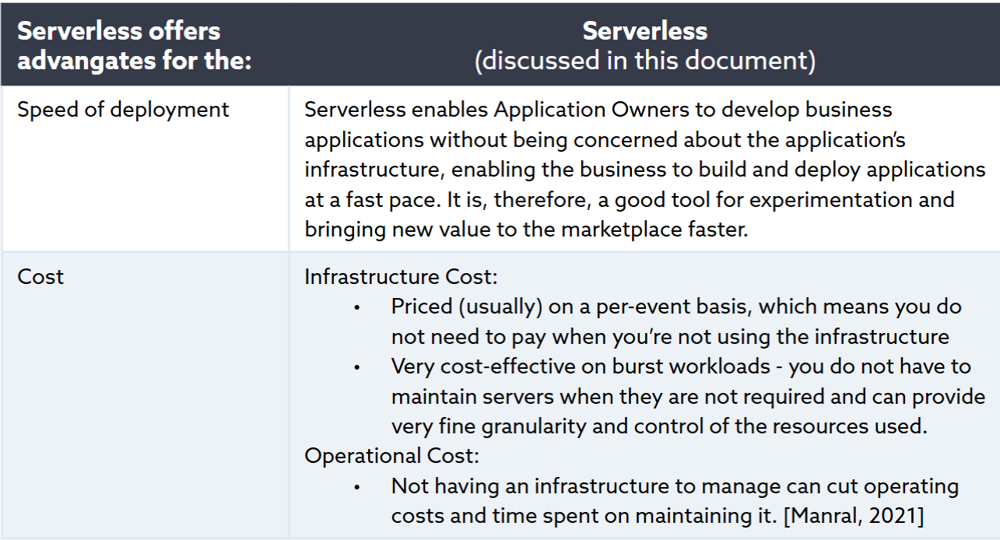
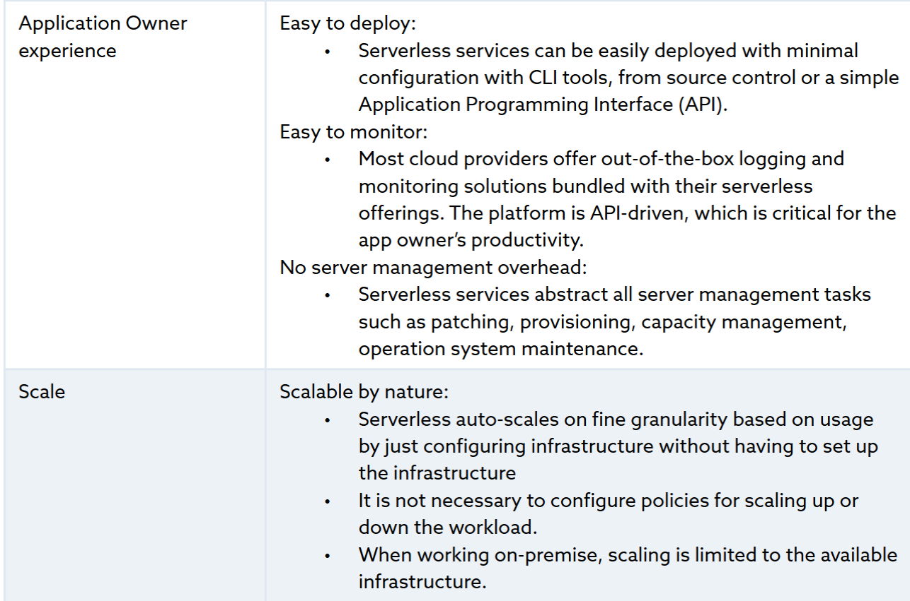
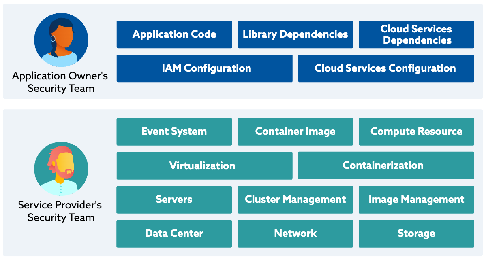
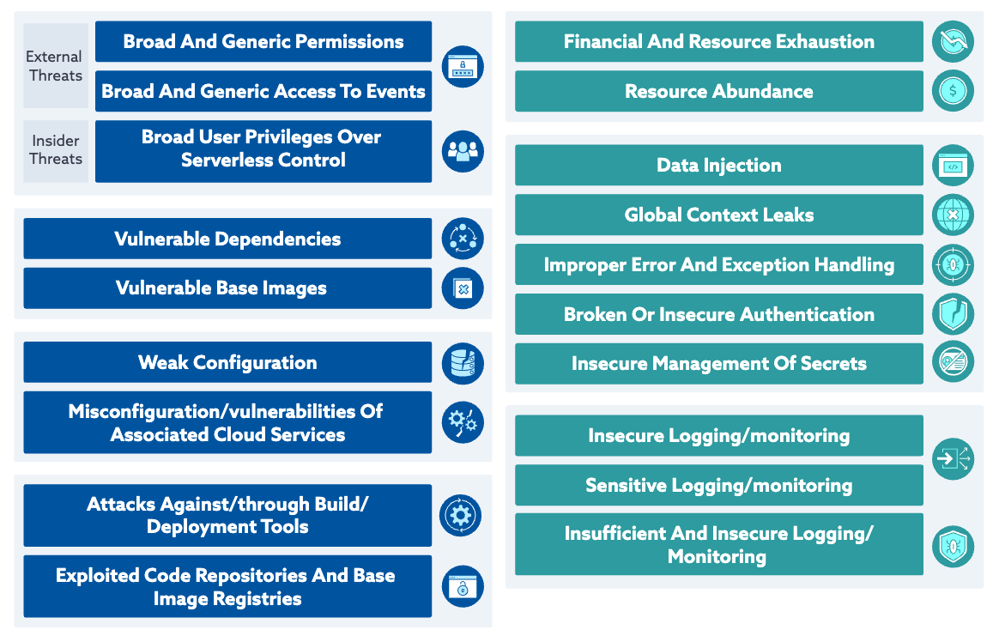
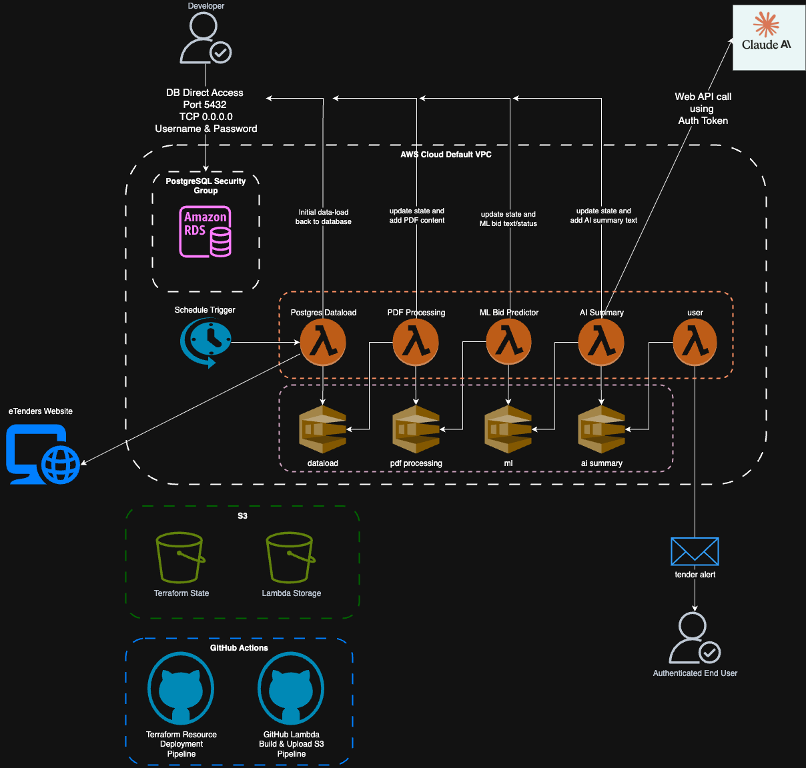
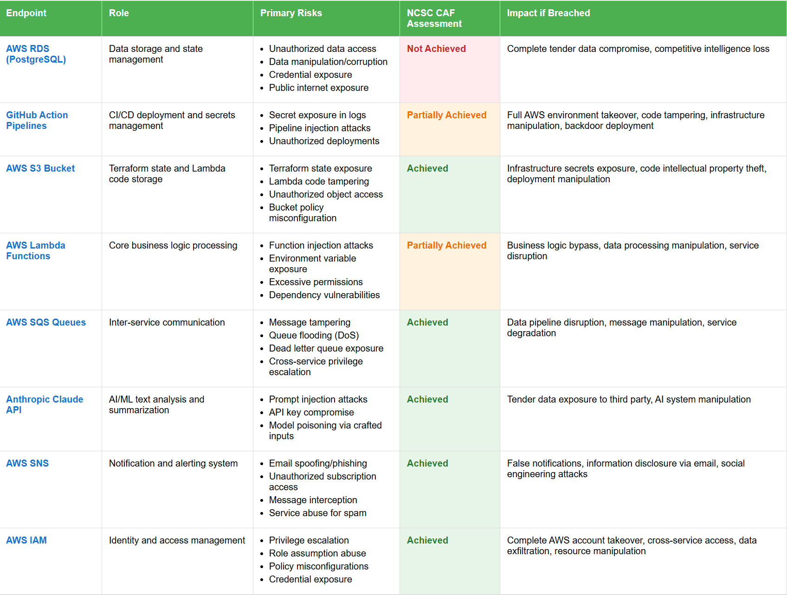
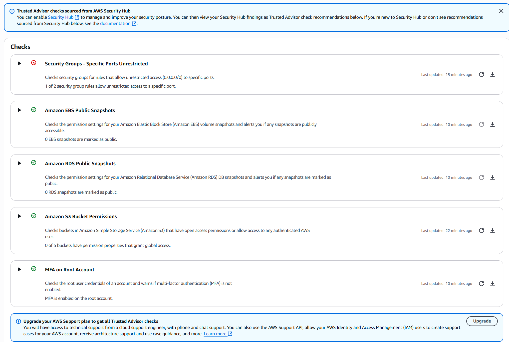
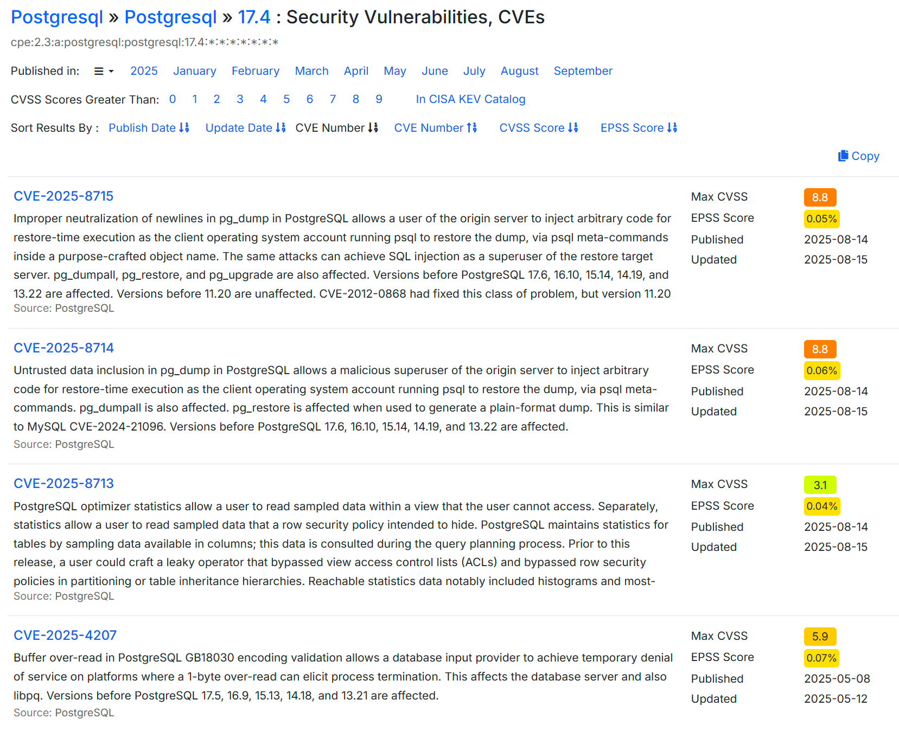

# Evaluation of Current State
Evaluating serverless application security differs from traditional networks but their use is justified by advantages they confer, especially related to cost and maintenance.



Figure 1 : Serverless Advantages (Cloud Security Alliance: 2023: 10)

Serverless architecture means developers focus on the application while everything else is abstracted away or becomes the responsibility of the cloud platform provider.


Figure 2 : Serverless Responsibility (Cloud Security Alliance 2023:11)

Note that there is still _shared_ responsibility because although many vulnerabilities have been removed there are new and unique issues in serverless applications.


Figure 3 : Setup and Deployment Stage Threats (Cloud Security Alliance 2023:20)

Committing secrets to code would be a "deployment stage" threat and a cloud provider wouldn't be liable for this type of mistake.

## Endpoint Inventory


Figure 4: Initial Application Diagram

Our application consists of serverless functions, an event-driven chain and PostgreSQL data store/state record.  

### AWS RDS (PostgreSQL) db connection
The first serverless function `postgres_dataload` gets the latest electronic tenders and stores them in the database. 

The database is updated by subsequent functions as the tender information passes through the ML/AI pipeline. 

It also records each Lambda step to help debugging the data manipulation pipeline. 

In future it could be used to drive further ML improvements via reinforcement learning or to expand the amount of model training data.

It's currently open to the internet for ease of development from Windows machine via the PgAdmin4 PostgreSQL client (www.pgadmin.org, n.d.). 

### GitHub action pipelines
Pipelines deploy Terraform defined resources into AWS, build the Lambdas (written in Rust) and upload them to S3. These pipelines use action secrets so that no password or other sensitive values are ever committed to the repository for attackers to re-use.

### AWS S3
The terraform state file is stored in S3 so multiple developers can work on the project simultaneously, rather than maintaining their own local state copy.

The S3 bucket is also where the AWS Lambdas are uploaded to when built. 

Each Lambda function grabs the .zip file from it's bucket and runs it as part of it's execution process.

### AWS Lambda functions & queues
All the Lambda functions exist within AWS. AWS Simple Queue Service is used to trigger and initialize new function instances when a message they're interested in lands on the queue and each Lambda post results onto the next queue in the chain.

Due to the way the Rust language is designed all the messages passed into and between the lambda's must conform to a pre-defined schema. It's not possible to inject or co-opt the messages because of this validation and data-integrity checking.  

### Anthropic Claude API endpoint
The AI Summary Lambda calls Claude's API endpoint via https. It is secured via an API Key that has been stored in the GitHub action secrets that is passed in to the AWS Lambda environment at the point the build pipeline runs. This secret isn't exposed in the build logs or anywhere else. 

### AWS Simple Notification Service
The sales team receives an alert to a potential bid via a list of validated email receivers. For security, the SNS service also uses a domain validated DNS account.

### AWS IAM 

Clearly identity and access management is the key to securely deploying, monitoring and managing any cloud-base application. Without a robust policy, use of least privilege and enforcement any account could come under attack and be taken over. 

AWS and Azure both enforce 2FA for increased account security (AWS, n.d.) with Microsoft going as far as mandating it from October 1st 2025 as announced in their recent blog (Shah, 2025) which contains this interesting data point.

```text
Microsoft research shows that multifactor authentication (MFA) can block more than 99.2% of account compromise attacks, making it one of the most effective security measures available.
```

## Cybersecurity Analysis

We can use the **NCSC Cyber Assessment Framework (CAF)** (NCSC, 2024) and **ISO 27001:2022**, which evaluates each endpoint against UK cybersecurity best practices. 

For AI/ML we can use the **OWASP LLM Top 10** (OWASPLLMProject Admin, 2024) and **ENISA's AI Cybersecurity Guidelines** (ENISA, 2023) which cover risks in AI systems and data processing.

There's also some pretty good overviews to help us with GitHub Action pipeline vulnerabilities (Singh, 2024)

### Risk Assessment Matrix

The following table uses the **NCSC CAF outcome assessments** outcomes to evaluate current security. 

- **Not Achieved**: Significant security gaps, immediate attention required
- **Partially Achieved**: Some controls in place but issues that need addressing
- **Achieved**: Security effectively implemented and maintained


Figure 5: Risk Assessment Table

Where endpoints are assessed as **Achieved** this is primarily through the use of 2 Factor Authentication to access AWS and GitHub.

AWS also have their own security review tooling which looks at the underlying infrastructure. 


Figure 6: AWS Security Review - _clearly highlights PostgreSQL open port risk_

At the database level, while there _are_ vulnerabilities they are at such a low possibility of being exploited that it's not worth worrying about.


Figure 7: PostgreSQL vulnerabilities

Very low EPSS scores indicate that these exploits are unlikely to be effectively executed in the wild (FIRST — Forum of Incident Response and Security Teams, 2025)

It's often security **misconfiguration** that leads to vulnerabilities (Huntress, 2025) so automated tools (e.g. AWS Security Review) can point out common issues that might lead to data compromise.

Assessing the CI/CD/GitHub pipeline as **Partially Achieved** is possibly harsh. Use of  2FA means that developer access, secrets management and the deployment pipeline are all very secure but it's not just about secrets...

There might be issues within the resources deployed by Terraform, especially within their configuration, as well as the Rust code or the crates (libraries) the Lambdas are built from.

We can also make some architectural changes to mitigate issues further and address "platform risk" (www.startupillustrated.com, n.d.) which is the over-reliance on a particular platform or service for something to work.


<!-- 
 * draw IO for network diagram
 * look at OWASP AI/LLM stuff
 * explain topology i.e. ALL CLOUD or STAR or something else
 * what are the key concepts on the diagram
 * argue for why improvements made, justify decisions
 * diagram for after, for example
 * support the WHY with industry best practice
  * GDPR is that's relevant
  * CVE's severity etc.

MILESTONE 3 - score the likelyhood of a breach vs. a framework. 
-->

<!--
* Create an Inventory of accessible network endpointscategorized by role, operating system and significance, using advanced scanning tools

* Create a basic network diagram that can include components like routers, switches, servers and workstations
-->

<!-- 
* Provide an overview of existing accessible and relevant protection mechanisms such as anti-virus, anti-malware and EDR systems, encryption and access controls

* Analyse the efficiency of these tools, highlight their advantages and disadvantages

* Analyse the effectiveness of protections and IDS/IPS systmes such as firewalls, VPNs, and endpoint protection software.

* Identify areas needing improvement, focusing on deficiencies that could expose endpoints to threats.

* My project is endpoint and data protection, out of the examples

-->

<!-- MARKING RUBRIC

CONDUCTS COMPREHENSIVE RESEARCH
* clear and detailed explanation of the network design, management and security
* include insightful examples and best practices
* create a detailed and well organised network diagram which...
  * accurately represents the network endpoints and their roles

EVALUATE A DIGITAL OR DATA NETWORK FOR COMMON VULNERABILITIES AND RISKS
* Conduct a thorough vulnerability assessment using industry standard tools
* analyze findings and identifies common vulnerabilities and risks in...
  * a clear and concise manner with...
  * additional insights and examples 

All this needs to be evidenced in this section

-->