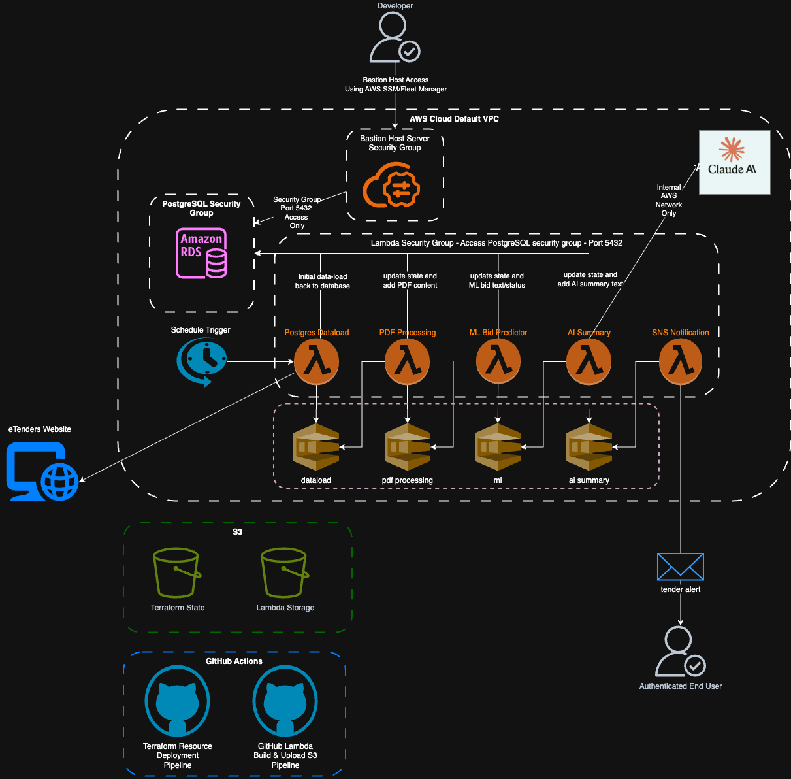

# Digital and Data Network Security Proposal 

## Secure the PostgreSQL database access

We can easily remove public access to the database and put the Lambda's in a security group so they can still access it but that means we restrict local developers from running queries or looking at the data themselves. 

Unless we move over to AWS Aurora (which can be queried via the AWS Console UI) we have to create a bastion server to control access to the AWS environment and run a PostgreSQL client from there. These steps do immediately address the biggest issue with the application and environment security overall.

Even though the older versions of the PGAdmin client has a few CVE's there are no new ones in 2025 and not for the latest version. We can still confidently use this, especially as it will now be running _behind_ the AWS 2FA boundary.

## Database backup 

Add secure automated backups to the database settings so that if an issue occurs we can at least roll back to the last known good state.

## Deploy additional checks as part of the GitHub Terraform deployment pipeline

We can add static code analysis tools (Trivy.dev, 2025) to the github CI/CD pipeline which will check all terraform files for vulnerabilities and misconfigurations of the resources we're building automatically in AWS. 

## Deploy additional code checks to examine GitHub commits for passwords

Automated secret scanning (Gitguardian.com, 2025) can be added because even if you delete a secret from a commit it'll remain in the git history and therefore accessible.

## Check AWS Lambda crates for malicious code

Recently spoof emails, proportedly from the Rust Foundation, led to attempts to corrupt some Rust libraries (Rogers, 2025). Developers must make conscious checks on libraries used to build applications nowadays. Rust has mitigations the library manifest requires packages to pin version numbers but this attack vector is definitely not a solved issue.

## Increase and enhance AWS Lambda logging

Part of the design of a secure serverless application (‌Cloudsecurityalliance.org, 2023) should include comprehensive logging and monitoring. 

At the moment there _are_ logs being generated by the various lambdas as part of the Rust Serverless crate but without associated alarms in AWS for errors/issues there's no notification coming back to the developer (or end user) when something goes wrong. Everything will just fail silently.

Manual testing might turn up something or the end-user might wonder where their emails have gone if they don't see any for a week or so but other than that there's nothing set up to surface a problem. No-one should sit there watching logs...

So with this in mind we need to investigate what can be done with the lambda logs, maybe something to look at the queues and come up with monitoring solution. Probably the first one would be if the initial `postgres_dataload` lambda can't get the eTenders information and the second alarm should be if the request to Claude (AI) fails or returns an error.

## Subscribe to Amazon's Security Hub CSPM

This AWS tool (Amazon.com, 2025 - Introduction to AWS Security Hub CSPM) provides a more in-depth view of your ongoing security position as well as an assessment of your deployed resources against industry standards and best practices. While we have "some" visibility from the Trusted Advisor checks (see next improvement) this would massively increase our confidence to deploy and maintain a secure application as well as protect the contents of our database on an ongoing basis.

While this would increase the application's running cost  we are still sitting on top of a bunch of serverless functions that are "pay on execution" so already we're not spending that much. Having some automatic scanning of the resources in the environment would help enormously.

## Upgrade AWS Support plan to get ALL Trusted Advisor Checks

As part of the basic AWS package you get "some" Trusted Advisor checks but upgrading means you also benefit from a much wider set of scans. The default Security Advisor package gets you 5 checks (see Figure 4 earlier) while the Upgraded Support plan gets you more than 50 security checks as well as Performance, Cost Optimization and Fault Tolerance advisories. This can also be set up to send to an email address so developers/maintainers don't miss possible issues.

## Introduce mandatory user access/event logging

Since the initial `postgres_dataload` Lamda triggers on a timer the only other serious access point is the PostgreSQL database itself. It's currently configured for access via a username & password but since it's hosted we can turn on user access logging. (Amazon.com, 2025. RDS for PostgreSQL database log files)

This depends on changing the database connection process to use AWS IAM database authentication instead but doing so means you're using connection parameters that are stored in AWS Secrets Manager, further increasing security.

## Architectural changes

An approach that is often overlooked is to reduce the overall attack surface by making architectural changes.

We could make two modifications to create a black box with just an internal schedule trigger to fetch the eTender data and a daily outbound email. There would be no access to anything other than via GitHub or AWS account compromise which, having set up 2FA on both, is extremely unlikely.

### Replace external Anthropic API call with AWS Bedrock

Bedrock is Amazon's cloud hosted AI platform. Using this would mean that the `ai_summary` lambda traffic doesn't need to leave the internal network at all. This would also reduce our reliance on Anthropic's external API remaining un-changed or allow us more flexibility to potential replace the call to Claude with something else, possibly cheaper.

Plugging into Bedrock likely also means we get more logging which would further enhance our troubleshooting ability.

### Remove the PostgreSQL database

The database holds whereabouts our eTender record is in the pipeline and could be used for for ML model retraining but we could also decide it's not needed.

We get logging from the Lambda functions themselves and could instead look at the SQS queue outputs to understand whether something was processed successfully or not. 

Now that we have the application running we could remove the database altogether.

### Replace the PostgreSQL database with Aurora DB instead

If we at least want to retain the DB, mainly for ML model retraining later, we could at least replace it with Aurora DB because this has an in-built AWS Query UI. 

This would allow us to interrogate it without having to maintain a bastion server to run the PostgreSQL client. 

There's also an Aurora Serverless offering which only runs when it needs to and since we're just running `postgresql_dataload` once per day this _might_ be cheaper. (Amazon Web Service, 2025) 

This costs $0.14 per hour while running our current RDS instance is costing $20 per month so it appears we could reduce this to about $3 per month...

These sorts of changes should definitely be considered longer term.

## Proposal Summary

Figure 8: Final Application Diagram

As can be seen in this diagram we've removed the two main external security risks, logging into the database over the open internet and sending our AI summary payload out to Anthropic's external facing API. 

<!-- 
* Based on your analysis, propose strategic enhancements to address identified vulnerabilities

* Research, evaluate and propose new security technologies such as advanced threat detection systems and robust encryption methods to effectively bridge current security gaps.

* Discuss scalability, reliability and security of the overall network architecture enhancements, justifying your proposal

* Explain how you would communicate proposal details to technical and non-technical stakeholders to gain buy in.

-->

<!-- MARKING RUBRIC

DESIGN A SIMPLE DIGITAL AND/OR DATA NETWORK
* Develop a well thought out digital and/or data network design based on industry standards and regulations
* INCLUDE concise explanations of the design principals and considerations for...
  * building a secure digital and/or data network with additional insights and examples

THIS APPLIES TO CURRENT_STATE_EVALUATION also

-->